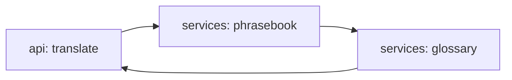

# voice-translator-multilingual

[](https://github.com/Shamanchi/voice-translator-multilingual/actions/workflows/ci.yml)
[](https://www.python.org/)
[](./Dockerfile)
[](./LICENSE)

> **English TL;DR:** FastAPI offline translator for EN/RU/ES/DE/FR: phrasebook first, then word-level glossary, unknown words marked `[?word]`, coverage reported. Fully offline, no tokens needed.

Офлайн-переводчик EN/RU/ES/DE/FR: сначала разговорник фразами, затем пословный глоссарий, неизвестные слова помечаются `[?word]`, покрытие считается. Работает офлайн.

Источник темы: `Hands-On-AI-Engineering / P-147 (audio/multilingual_audio_translator)` — идею и постановку взяли из каталога, код и тексты написаны с нуля.

## Какую задачу решает

Нужен перевод без интернета: агент переводит короткие фразы между пятью языками, честно показывает покрытие словаря и подсвечивает непереведённые слова.

## Архитектура



Слои: `api/` → `services/` → `core/`, настройки через `pydantic-settings`.

## Быстрый старт

```bash
cp .env.example .env
pip install -r requirements.txt
uvicorn app.main:app --reload
curl -X POST http://127.0.0.1:8000/api/v1/translate -H "Content-Type: application/json" -d "{\"text\": \"hello, thank you\", \"source\": \"en\", \"target\": \"es\"}"
```

Docker:

```bash
docker compose up --build
```

## API

- `GET /api/v1/health` — проверка сервиса.
- `GET /api/v1/languages` — поддерживаемые языки.
- `POST /api/v1/translate` — перевод. Тело: `{"text": "hello", "source": "en", "target": "es"}`. Ответ: `translation`, `coverage`, `unknown`.

Пример ответа `translate` (сокращённо):

```json
{
  "translation": "hola, gracias",
  "coverage": 1.0,
  "unknown": []
}
```

## Переменные окружения (.env)

| Переменная | Назначение | По умолчанию |
|---|---|---|
| `APP_HOST` / `APP_PORT` | Хост/порт API | `0.0.0.0` / `8000` |

Полный список — в [.env.example](./.env.example).

## Тесты

```bash
pip install -r requirements.txt
pytest -q
pytest -q -m integration
```

Unit-тесты без сети. Интеграционные (`-m integration`) — через TestClient, тоже без сети.

## Контакты

- Telegram: @PavelYrevichh
- Email: Lietman46@mail.ru
- GitHub: Shamanchi
- FL.ru: https://www.fl.ru/users/Shamanchi
